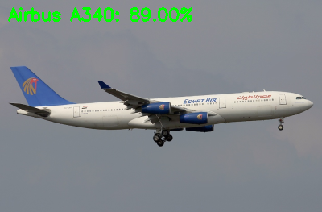

# Aviation AI

This project provides the toolset and algorithms to train a Convolutional Neural Network to recognize various models of commercial aircraft in imagery. It has applications in plane spotting and can help sort your endless archives of airshow pictures!

The dataset used for training is the FGVC-Aircraft Dataset made available by the University of Oxford. The dataset contains 10,200 images of aircraft, with at least 100 images for each of the 102 different aircraft models. 

Fine-Grained Visual Classification of Aircraft, S. Maji, J. Kannala, E. Rahtu, M. Blaschko, A. Vedaldi, arXiv.org, 2013

## Training

Before training the convolutional neural network the datset must be unpacked into a more useable structure. 

``` bash
python unpackDataset.py
````

The ```unpackDatset.py``` script builds a lookup table of the manufacturer and family of aircraft per unique id and sorts the images into the appropriate directories. The script also removes any metadata from the bottom of the image.

``` bash
python train.py -d DATASET -m MODEL -l LABELS -w WEIGHTS
```

## Classification

``` bash
python classify.py -m MODEL -l LABELS -i IMAGE
```


